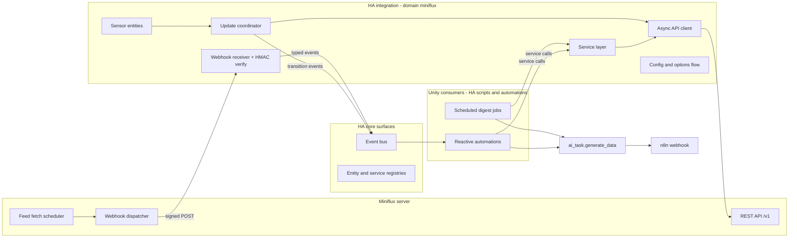

# Miniflux ⇄ Home Assistant Integration — System Architecture

**Status:** Design (input to implementation planning)
**Scope:** Greenfield Home Assistant custom integration (domain: `miniflux`) that acts as the boundary object between a self-hosted Miniflux instance and the "Unity" reading/scoring layer (HA scripts + `ai_task` + n8n).
**Audience:** The next planning pass, which will turn this into a detailed implementation plan for a TDD implementation pass. This document says *what exists, how it connects, and why* — not how to build it.

---

## 0. System context and the one boundary rule

**The one boundary rule:** the integration wraps Miniflux and *only* Miniflux. It never knows that n8n, `ai_task`, rubrics, or scoring exist. Everything downstream of "here is entry data / here is an event" lives in HA scripts and automations (the Unity layer). This is the load-bearing decision of the whole design — see D5 — because the pipeline's *policy* (which categories, which prompts, what survives) changes weekly, while the Miniflux *plumbing* (auth, pagination, signature verification, error mapping) is stable. Coupling them would force integration releases for prompt tweaks and make the integration untestable without a scoring stack.

Consequence worth stating up front: the user's suggested "batch scoring run completed" event is deliberately **not** an integration event. The integration cannot know when a scoring run completes because it doesn't run them. Unity scripts should fire their own custom event (e.g. `unity_run_complete`) as their last step; the conventions section of the setup docs shows this. Everything else the user asked for lands inside the integration.

---

## 1. Component map

### 1.1 Components that exist

| # | Component | Why it exists |
|---|-----------|---------------|
| C1 | **Async API client** (one per config entry) | Single choke point for every HTTP conversation with Miniflux: auth header injection, timeouts, typed error mapping, pagination, concurrency cap. Nothing else in the integration ever touches HTTP. |
| C2 | **Update coordinator** (HA `DataUpdateCoordinator`, one per config entry) | Polls the cheap aggregate endpoints on an interval, holds the canonical snapshot (feeds, counters, starred total), detects state *transitions* (feed healthy→erroring), and is the single source all entities render from. |
| C3 | **Entity layer** — 3 sensors + 1 binary sensor | Dashboard/automation-visible state. Deliberately low cardinality (see D3): entities are projections over C2's snapshot, never API callers. |
| C4 | **Webhook receiver** (one HA webhook endpoint per config entry) | Terminates Miniflux's native signed webhook: verifies HMAC centrally, validates the envelope, re-emits compact typed HA events, and nudges C2 to refresh. Automation authors never touch signatures (see D1). |
| C5 | **Service layer** — three families: query, entry-mutation, feed/category admin | The programmable surface Unity consumers call. Registered once per domain; each call targets a config entry. Boundaries and rationale in §4. |
| C6 | **Config flow + options flow + reauth flow** | UI setup of URL/API key; two-phase webhook secret handshake (see D9); polling and webhook options; standard reauth on expired API key. |
| C7 | **Repairs + diagnostics** | Repair issues for *integration wiring* problems (webhook secret missing, signature failures); diagnostics dump (redacted) for bug reports. Content-level problems (broken feeds) are *not* repairs — they belong to C3's health sensor and C2's transition events. |
| C8 | **Event vocabulary** | Not a runtime component but a public contract: the four `miniflux_*` bus event types defined in §3.5. |

### 1.2 Components deliberately absent

- **Per-feed or per-category entities.** Cardinality and lifecycle churn; see D3. Feed-level data flows through attributes, events, and the `get_feeds` service instead.
- **Button/switch entities** (e.g. a "refresh all feeds" button). Services already cover this; a button adds registry surface for something invoked from scripts, not dashboards. Trivially added later if dashboard demand appears.
- **HA `event` entities** mirroring the bus events. They would duplicate recorder rows without adding automation power (bus events already trigger automations).
- **Any n8n client or scoring logic.** Boundary rule above.
- **Entry storage in HA.** Miniflux *is* the datastore. The integration never persists entries; the recorder must not become a shadow RSS database (this constraint drives the compact-event decision D2).
- **A pip dependency on the official `miniflux` Python client.** It is synchronous (requests-based); HA is asyncio-native. Wrapping sync calls in executor threads buys nothing for ~15 small endpoints. C1 is a thin embedded aiohttp client instead (see D6).

---

## 2. Data flows (prose traces)

### 2.1 Reactive path — Miniflux webhook → HA event → Unity automation

1. Miniflux's own scheduler fetches a feed and finds new entries.
2. Miniflux POSTs a JSON payload (`event_type: new_entries`, the feed object, and the **full** entry objects including content) to the integration's webhook URL `https://<ha>/api/webhook/<webhook_id>`, with an HMAC-SHA256 signature of the raw body in its signature header, keyed by the secret Miniflux generated when the URL was configured.
3. The webhook receiver (C4) reads the raw body (bounded by a generous size guard, ~10 MB, to cap memory), and **verifies the signature before parsing anything**, using a constant-time comparison against the secret stored in the config entry.
   - *No secret configured yet:* respond 401, drop the payload, raise a Repair issue ("Miniflux is delivering webhooks but no secret is configured") once, rate-limited. No event is ever emitted from an unverified payload — the HA bus is trusted by automations, so nothing unsigned may reach it.
   - *Bad signature:* respond 401, log at warning (rate-limited), raise a Repair issue after repeated failures (likely a secret mismatch after webhook reconfiguration in Miniflux).
4. The verified body is parsed and validated against the expected envelope (pure function; malformed → 400 + warning log, never an exception escaping to the webhook framework).
5. The receiver re-emits a **compact** typed HA event `miniflux_new_entries` (§3.5): feed identity, counts, and a capped list of per-entry projections (id/title/url/published/author) — **never** entry content (D2). It responds 200 to Miniflux.
6. The receiver nudges the coordinator via a debounced refresh request, so the unread sensor catches up within seconds instead of at the next poll tick.
7. A Unity automation triggered by the event decides cheaply from titles/feed whether the batch is interesting; if it needs bodies it calls `miniflux.get_entries` with the event's entry IDs (`include_content: true`, optionally `fetch_original: true` for readability-scraped full text).
8. The automation hands text to `ai_task.generate_data`, posts survivors to n8n, then calls `miniflux.update_entries` to mark the processed IDs read (and/or star keepers). The mutation triggers another debounced coordinator refresh so sensors don't lie until the next poll.

**Failure branches:** Miniflux webhook delivery is best-effort (assume no retries — R2); if HA is restarting when a webhook fires, that event is simply lost. This is why the reactive path is an *accelerator*, never the system of record: anything a reactive automation would do must also be recoverable by a batch consumer querying `status=unread` later. Consumers must treat events as at-most-once *and* (because replays are possible — see D1) as non-authoritative: act on queried state, not on event payloads alone.

### 2.2 Batch path — scheduled Unity consumer → query services → ai_task → n8n

1. A time trigger fires a Unity script (e.g. "morning personal digest": categories News+Tech, unread, last 36 h).
2. The script calls `miniflux.count_entries` with its filter set. If the total is 0 (or below its own threshold), it exits — one cheap API round-trip, no entry payloads moved.
3. It calls `miniflux.search_entries` with the same filters plus `limit`, ordering, and `include_content` as its rubric requires. The service auto-paginates against Miniflux internally up to `limit` and returns `{total, count, entries}` (D7) — no YAML pagination loops.
4. The script chunks entries to fit `ai_task` context (chunking policy is consumer-side — R6), calls `ai_task.generate_data` with its rubric and a structured output schema, and validates/filters the result (score thresholds, clustering).
5. Survivors are POSTed to the n8n webhook by the script (`rest_command` or equivalent) using the Unity envelope convention (§3.6). n8n validates its own input — defense in depth at every hop.
6. The script calls `miniflux.update_entries` with the exact entry IDs it processed, setting `status: read` (and `starred: true` for keepers if that's the rubric). **By-ID marking, never `mark_all_read`**, so entries that arrived between steps 3 and 6 survive to the next run — this is the race that scope-level mark-all would silently lose.
7. Optionally the script fires its own `unity_run_complete` event with run stats, and the failure path (any service call raising) is caught by the script to notify — service errors surface as proper HA script errors with readable messages (§3.3), so a failed 3 a.m. run is visible in traces/logs, not silent.

**Idempotency:** every step is re-runnable. Queries are reads; `update_entries` is declarative (setting `read` twice is a no-op); n8n should dedupe on entry ID or the script's `run_id`. A crashed run re-executed picks up the still-unread remainder.

### 2.3 Poll/health path — coordinator cycle

1. Every `scan_interval` (default 300 s, floor 60 s), the coordinator issues three cheap GETs via C1: the feed list (which embeds per-feed `parsing_error_count`, `parsing_error_message`, `checked_at`, category), the per-feed read/unread counters, and a `starred=true, limit=1` entries query for its `total`.
2. A pure aggregation step derives: global unread, per-category unread rollup (joining counters to feeds' categories), starred total, total feeds, and the set of feeds with `parsing_error_count > 0`.
3. A pure diff against the previous snapshot yields transition events: a feed entering the error set fires `miniflux_feed_error`; a feed leaving it fires `miniflux_feed_recovered`. First poll after startup establishes a baseline and fires nothing (restart must not spam recovery/error events).
4. Entities re-render from the snapshot. On fetch failure the coordinator marks the data update failed: content sensors become `unavailable`, while the reachability binary sensor — which overrides availability — flips to `off` (disconnected) and keeps its `last_success_at` / `last_error` attributes. Auth failures (401) instead trigger HA's reauth flow (C6).
5. Webhook receipts and entry mutations request refreshes through a shared debouncer (~10 s cooldown), so a burst of feed refreshes on the Miniflux side coalesces into one poll.

**Division of authority:** poll is authoritative, webhook is acceleration. Sensors and health state must be correct with webhooks entirely unconfigured; webhooks only reduce latency. This redundancy is deliberate, not waste — it is what makes lost webhook deliveries harmless.

---

## 3. Interfaces and contracts

### 3.1 Miniflux REST API → API client (C1)

Endpoints the integration uses (all under the instance base URL, which may include a sub-path; auth via the `X-Auth-Token` API-key header):

| Purpose | Endpoint |
|---|---|
| Validate credentials / identity | `GET /v1/me` |
| Server version (device info) | `GET /v1/version` (older instances: `/version`) |
| Feed inventory + health | `GET /v1/feeds` |
| Per-feed unread/read counters | `GET /v1/feeds/counters` |
| Entry search (global / per feed / per category) | `GET /v1/entries`, `GET /v1/feeds/{id}/entries`, `GET /v1/categories/{id}/entries` — filters: `status` (repeatable), `starred`, `search`, `category_id`, `published_after/_before`, `order`, `direction`, `limit`, `offset` |
| Single entry / hydration | `GET /v1/entries/{id}` |
| Readability full text | `GET /v1/entries/{id}/fetch-content` |
| Bulk status change | `PUT /v1/entries` (body: `entry_ids`, `status`) |
| Star flag | `PUT /v1/entries/{id}/bookmark` — **toggle semantics** (see D8) |
| Scope-level mark read | `PUT /v1/feeds/{id}/mark-all-as-read`, `/v1/categories/{id}/mark-all-as-read`, `/v1/users/{id}/mark-all-as-read` |
| Feed CRUD + refresh | `POST/PUT/DELETE /v1/feeds[/{id}]`, `PUT /v1/feeds/{id}/refresh`, `PUT /v1/feeds/refresh` |
| Feed discovery | `POST /v1/discover` |
| Category CRUD | `GET/POST/PUT/DELETE /v1/categories[/{id}]` |
| OPML | `POST /v1/import`, `GET /v1/export` |

Exact parameter/field names must be pinned against the deployed Miniflux version during implementation (R1); the contracts below are expressed in *integration-level* field names precisely so that mapping drift is absorbed inside C1 and nowhere else.

**Error mapping (lives entirely in C1):**

| HTTP outcome | Typed client error | Surfaced as |
|---|---|---|
| Timeout / connect / DNS / TLS | `connectivity` | Coordinator: update-failed → entities unavailable, reachability sensor `off`. Services: HA error "Miniflux unreachable at \<url\>: \<cause\>". |
| 401 | `auth` | Coordinator/setup: `ConfigEntryAuthFailed` → reauth flow. Services: HA error telling the user to reauthenticate. |
| 400 / 422 | `bad-request` (carries Miniflux's `error_message`) | Service validation error with Miniflux's message verbatim — the caller sent something Miniflux rejected. |
| 404 | `not-found` | Service validation error naming the missing id; in `get_entries` bulk hydration, contributes to `missing` instead of failing the call (partial success, §3.3). |
| 5xx | `server-error` | Coordinator: update-failed. Services: HA error with status + body snippet. |

**Retry policy (in C1):** idempotent GETs retry once after a short jittered delay on connectivity/5xx; mutations never auto-retry (a re-run of a declarative mutation is the caller's safe retry). A small concurrency semaphore (~4 in-flight requests per entry) is the politeness cap — self-hosted Miniflux has no server-side rate limiting to negotiate with, and a batch consumer hydrating 50 entries must not stampede a small server. No exponential-backoff machinery beyond this: the coordinator's interval *is* the retry loop for polling, and masking a down server with aggressive retries would defeat the health surface whose whole job is to make that visible (D10).

**Time normalization rule:** Miniflux speaks RFC 3339 with instance timezones and Unix timestamps in some filters. C1 converts all outbound filter times from HA datetimes, and all inbound timestamps to timezone-aware UTC ISO 8601 strings before anything else sees them. No other layer does time math.

### 3.2 API client → integration internals (normalized objects)

All internal consumers (coordinator, services, webhook re-emitter) speak these shapes, never raw Miniflux JSON:

- **Entry** — `id`, `feed_id`, `feed_title`, `category_id`, `category_title`, `title`, `url`, `author`, `published_at` (UTC ISO), `changed_at`, `status` (`unread|read|removed`), `starred` (bool), `reading_time` (min), `tags` (list, feed-supplied), `content` (HTML string; present only when content was requested).
- **EntryCompact** — `id`, `feed_id`, `title`, `url`, `published_at`, `author`. The event-safe projection: bounded size, no content. Titles truncated to 256 chars.
- **Feed** — `id`, `title`, `site_url`, `feed_url`, `category_id`, `category_title`, `checked_at`, `parsing_error_count`, `parsing_error_message`, `disabled` (bool).
- **Snapshot** (coordinator data) — `fetched_at`, `feeds: [Feed]`, `unread_total`, `unread_by_feed: {feed_id: n}`, `unread_by_category: [{id, title, unread}]`, `starred_total`, `error_feeds: [Feed]` (the `parsing_error_count > 0` subset).

Categories are derived from feeds' embedded category objects; a category containing zero feeds is therefore invisible to the rollup (acceptable — it also contains zero entries; noted in R10 territory only if someone objects).

### 3.3 Services → calling scripts (the programmable surface)

Common conventions for every service:

- **Targeting:** optional `config_entry_id`; required only when more than one Miniflux entry is configured, otherwise resolved to the single entry. Wrong/ambiguous → validation error (D8/multi-instance, see also D9… targeting rule stated once here, applies everywhere).
- **Errors:** caller mistakes (bad filter combination, unknown category name, missing required field) raise HA *validation* errors before any HTTP happens; Miniflux/transport failures raise HA errors with the mapped message from §3.1. Both fail the calling script step visibly — no silent empty returns on failure, ever. An empty result is `{total: 0, entries: []}`, which is success.
- **Category/feed reference sugar:** `category` and `feed` fields accept either the numeric Miniflux ID or the exact title string; titles resolve against the coordinator's cached snapshot (no extra API call) and raise a validation error when unknown or ambiguous. IDs are always authoritative; titles are script-author ergonomics.

**Query family** (all return response data; read-only):

| Service | Request (beyond conventions) | Response |
|---|---|---|
| `miniflux.search_entries` | `category?`, `feed?`, `status?` (list of `unread/read/removed`; default `unread`), `starred?`, `search?` (free text), `published_within?` (duration) *or* `published_after?`/`published_before?` (datetimes; `within` is sugar the schema forbids combining with the explicit pair), `order?`, `direction?`, `limit?` (default 100, hard cap ~500), `include_content?` (default **false**), `fetch_original?` (default false; implies content; slow — hits origin sites) | `{total, count, entries: [Entry]}` — `total` is Miniflux's full match count, `count` is entries returned; auto-paginated internally (D7) |
| `miniflux.count_entries` | Same filter fields; no pagination/order/content fields | `{total}` |
| `miniflux.get_entries` | `entry_ids` (1–100), `include_content?` (default **true**), `fetch_original?` | `{entries: [Entry], missing: [id]}` — partial success: deleted/unknown IDs land in `missing` rather than failing the batch (events race against deletions) |
| `miniflux.get_feeds` | `category?`, `only_with_errors?` (default false) | `{feeds: [Feed]}` — live fetch, not cache: the remediation/inventory surface that replaces per-feed entities |

**Entry-mutation family** (idempotent, declarative):

| Service | Request | Response (optional) |
|---|---|---|
| `miniflux.update_entries` | `entry_ids` (1–500), `status?`, `starred?` — at least one of the two | `{updated: n}` |
| `miniflux.mark_all_read` | exactly one of `feed` / `category` / `everything: true` | — |

`mark_all_read` is the human "declare bankruptcy" convenience; its description must carry the race warning from §2.2 steering pipelines to `update_entries`.

**Admin family** (feed/category lifecycle; one service per verb — rationale in §4):

| Service | Request | Response |
|---|---|---|
| `miniflux.create_feed` | `feed_url`, `category?`, `crawler?` plus a small curated subset of Miniflux feed options | `{feed_id}` |
| `miniflux.update_feed` | `feed` + mutable fields subset (title, category, feed_url, disabled, crawler, scraper/rewrite rules…) | — |
| `miniflux.delete_feed` | `feed` (single; no bulk — destructive) | — |
| `miniflux.refresh_feed` | `feed` (required) | — |
| `miniflux.refresh_all_feeds` | — (separate service: N-fetch blast radius should not be an omitted-argument away from the 1-fetch one) | — |
| `miniflux.discover_feeds` *(optional tier)* | `url` | `{feeds: [candidates]}` |
| `miniflux.create_category` / `update_category` / `delete_category` *(optional tier)* | `title` / id+title / id | `{category_id}` / — / — |
| `miniflux.export_opml` *(optional tier)* | — | `{opml}` (string; can be large — callers write it to a file for the nightly-backup automation this enables) |
| `miniflux.import_opml` *(optional tier)* | `opml` (string) | — |

"Optional tier" = contractually specified now, implementable after the core; they are thin passthroughs whose absence doesn't block Unity.

### 3.4 Webhook: inbound contract and verification

- **Inbound (from Miniflux):** POST, JSON body; signature header carrying hex-encoded HMAC-SHA256 of the *raw request body*, keyed by the Miniflux-generated secret; an event-type header distinguishing `new_entries` from `save_entry`. Exact header names pinned at implementation (R1).
- **Verification order is a hard invariant:** read raw bytes → verify HMAC (constant-time) → only then parse JSON → validate envelope → emit. Responses: 200 verified-and-accepted (even if the event is uninteresting), 401 unverifiable (no/bad secret), 400 verified-but-malformed.
- **Replay caveat:** the signature scheme has no timestamp/nonce, so a captured delivery can be replayed at any time by anyone who can reach the endpoint. Mitigations: `local_only` webhook registration by default (LAN-only reachability), and the §2.1 consumer rule that events are advisory — act on queried state, not event payloads. Residual risk is acknowledged, not hidden (D1).

### 3.5 HA event vocabulary (outbound public contract)

All events carry `config_entry_id` and `instance_url` so multi-instance setups can discriminate.

| Event type | Fired when | Payload |
|---|---|---|
| `miniflux_new_entries` | Verified `new_entries` webhook | `feed: {id, title, category_id, category_title, site_url}`, `entry_count` (true count), `entries: [EntryCompact]` capped at 50, `truncated` (bool) |
| `miniflux_entry_saved` | Verified `save_entry` webhook (user hit "save" in Miniflux UI) | `entry: EntryCompact` |
| `miniflux_feed_error` | Coordinator diff: feed entered error state (0 → >0 parsing errors) | `feed: {id, title, category_id, category_title}`, `parsing_error_count`, `parsing_error_message` |
| `miniflux_feed_recovered` | Coordinator diff: feed left error state | `feed: {…}`, `error_duration_estimate?` (best effort — poll-resolution accuracy) |

Payloads are bounded (compact projections, caps, truncation flags) because fired events are persisted by HA's recorder, which drops oversized event data — an event that silently fails to record is a debugging trap. Connectivity up/down deliberately has **no** event: the reachability binary sensor's state change is already a first-class automation trigger, and duplicating entity state as events is bus noise.

`miniflux_entry_saved` is worth its tiny cost: Miniflux's native "save entry" action becomes a zero-UI **manual push-to-pipeline gesture** — the human reads something in Miniflux, hits save, and a Unity automation can hydrate and route it immediately. This is the cleanest answer to "how does a human shove one specific article into the pipeline right now" (see also §5-engagement).

### 3.6 Entities

| Entity | State | Attributes | Notes |
|---|---|---|---|
| `sensor.miniflux_unread_entries` | global unread (int) | `by_category: [{id, title, unread}]` (capped at 100 categories) | Primary pipeline-depth signal |
| `sensor.miniflux_starred_entries` | starred total (int) | — | Human-flagged queue depth (engagement signal for consumers) |
| `sensor.miniflux_feeds_with_errors` | count of feeds with parsing errors (int) | `feeds: [{id, title, category_title, parsing_error_count, parsing_error_message, checked_at}]` capped at 25 + `truncated`, `total_feeds` | Diagnostic category; automation trigger is `state > 0`, detail via attributes or `get_feeds(only_with_errors)` |
| `binary_sensor.miniflux_reachable` | connectivity (on/off) | `last_success_at`, `last_error`, `last_webhook_at`, `server_version` | Diagnostic; **overrides availability** so it stays present and truthful when polls fail (everything else goes `unavailable`) |

`last_webhook_at` earns its slot: it is the setup-verification and "is Miniflux actually delivering?" probe (used in the setup docs' verification step). All entities hang off one HA device per config entry representing the Miniflux instance (name, base URL, `sw_version` from the version endpoint).

### 3.7 Downstream contract (Unity → ai_task → n8n) — convention, not integration surface

The integration's responsibility ends at service responses and events. For pipeline coherence the setup docs ship a *recommended* envelope for script→n8n handoff: `{run_id, consumer, generated_at, source: {categories, window}, stories: [{entry_id, url, title, score, rationale, cluster?}]}` — with validation living where the data is produced/consumed: scripts validate `ai_task` structured output (use `ai_task`'s output schema support) before POSTing; n8n validates its inbound payload. The integration neither emits nor checks this envelope.

---

## 4. Service boundary rationale

The skeleton's single `search_entries` mega-service fails in both directions at once: as *one* service it must multiplex return shapes (list vs count) and semantics (read vs write would be worse still); yet the opposite extreme — one service per REST endpoint — leaks Miniflux's URL layout as the API and forces callers to know, e.g., that starring is a different endpoint from status. Neither is a responsibility cut. The cut used here follows three rules:

**Rule 1 — merge where the request schema is shared and the intent differs only in output.**
`search_entries`, `count_entries`, and (partially) `get_entries` share one filter/validation module. Count is not a `limit: 0` flag on search because response-shape polymorphism is a contract smell: a script wired for `{entries: []}` silently breaks when someone flips a flag and gets `{total}`. Two names, one schema, stable shapes — and `count_entries` gives batch consumers their cheap pre-flight (§2.2) with self-documenting intent in automation traces.

**Rule 2 — merge mutations that are declarative over the same target set; keep blast-radius classes apart.**
`update_entries` takes an ID list and desired end-state (`status`, `starred`) — one service, because "set these entries to this state" is one responsibility regardless of which Miniflux endpoints implement it (bulk status endpoint + per-entry star toggle wrapped into declarative semantics, D8). But scope-level `mark_all_read` is a separate service, not an `entry_ids: all` sentinel, because "mutate exactly these N ids" and "mutate everything matching a scope" are different risk classes that should never be one typo apart. Same logic separates `refresh_feed` from `refresh_all_feeds`.

**Rule 3 — split admin CRUD per verb, because HA service schemas are static.**
A `manage_feed(action: create|update|delete)` enum-service cannot express "on create, `feed_url` is required; on delete, only `feed` is; on update, everything is optional" — validation degrades to runtime string checks and the HA service UI renders a lie. Per-verb services give each operation an honest schema, honest docs, and isolate the destructive verb (`delete_feed`) behind its own explicit name. This *looks* like endpoint-per-service, but the driver is schema honesty, not URL symmetry — where schemas unify (queries, entry mutations) the services merged.

Finally, `get_entries` (hydration by ID) exists *because of* an architectural decision elsewhere: compact events (D2) are only viable if there's a first-class way to turn event IDs back into full content. Service design and event design are one contract — this pairing is the reactive path's hinge.

---

## 5. Key design decisions

**D1 — Webhook receiver lives in the integration; HMAC verification is central, mandatory, and precedes everything.**
*Alternative:* users point Miniflux at a generic HA webhook trigger and verify signatures in their automations. *Rejected because* signature verification in YAML/templates is somewhere between miserable and impossible (raw-body access, constant-time compare), so in practice every DIY user would skip it — making "forgot to verify" the default state of the ecosystem. Centralizing gives: one audited implementation, unsigned payloads never reaching the bus, secret stored in the config entry (not sprinkled through automations), and a clean typed event as the public product. *Consequence honestly stated:* Miniflux's scheme is unsalted-by-time HMAC → replayable; mitigations (local_only default, advisory-events consumer rule) in §3.4. The event bus trust model is the crux: anything on the bus will be acted on by automations, so admission control must be structural, not conventional.

**D2 — Events are notifications, not payload trucks.**
The raw `new_entries` webhook carries full entry content — tens of KB per entry, potentially MBs per delivery. Re-emitting that on the bus would bloat the recorder (which caps/drops oversized event data) and normalize automations that act on stale embedded content. Compact projections + `get_entries` hydration keeps events small, recorder healthy, and makes fresh-state-at-time-of-use the natural pattern. Cost: one extra service call on the reactive path when content is needed. Cheap, local, and only paid when bodies are actually wanted.

**D3 — Sensor cardinality: aggregate entities with structured attributes; transitions as events; never per-feed entities.**
*Per-feed entities* (hundreds of feeds; feeds churn) mean entity-registry churn, stale-entity cleanup logic, and recorder load — for automation needs that are really about *transitions*, which events serve better. *Per-category entities* were the closer call: categories are low-cardinality and user-curated, and separate entities would get native history graphs and long-term statistics. Chosen anyway: attributes on the global unread sensor — because category lifecycle (create/rename/delete in Miniflux) would otherwise demand dynamic entity management and stable-unique-ID policy for someone else's mutable taxonomy, and because no identified consumer needs per-category *history* (consumers query live state). The escape hatch is documented, not built: a template sensor over the attribute gives any single category a chartable entity in three lines of user YAML; if real statistics demand appears, per-category entities can be added later behind an option without breaking the attribute contract (R8).

**D4 — Hybrid poll + webhook, with poll authoritative.**
Webhooks alone can't power the sensors (no webhook exists for counts or feed health) and are best-effort delivery; polling alone means minutes of latency on the reactive path. Hybrid with a debounced webhook→refresh nudge gets near-real-time sensors and event-driven automations while remaining fully functional with webhooks unconfigured. The redundancy is the resilience mechanism — not an inefficiency to optimize away.

**D5 — Thin waist: mechanism in the integration, policy in Unity scripts.**
The integration owns transport, auth, validation, pagination, caps, normalization, health, and safety (signature checks, declarative mutations). It owns zero orchestration: no rubrics, no thresholds, no n8n, no schedules beyond its own polling. Rationale: the two layers change at wildly different rates (prompt/rubric iteration is weekly; plumbing is stable), are tested with different harnesses, and the swap-ability of the downstream (replace n8n, add a second consumer) must not touch integration code. This also keeps the integration honest as a general-purpose Miniflux integration — Unity is *a* consumer, not a dependency.

**D6 — Embedded thin async client instead of the official PyPI `miniflux` package.**
The official client is synchronous; HA would need executor threads per call, and the integration uses ~15 endpoints of a stable, simple REST API. A thin aiohttp client (HA-shared session, typed errors, one place for the §3.1 mapping) is less total machinery. Trade-off: we own contract drift — mitigated by the versioned fixture library in §8 and by confining all Miniflux knowledge to C1. If core-HA submission ever matters, the client extracts to PyPI mechanically (its seam is already library-shaped).

**D7 — Pagination lives inside `search_entries`.**
Miniflux pages with limit/offset; YAML loops with offset arithmetic are where 3 a.m. pipelines die. The service accepts one `limit` (capped ~500) and walks Miniflux pages internally, returning `total` so callers *know* when more exists. Deliberate non-goal: streaming/unbounded export through a service response — a consumer that wants thousands of entries per run should narrow its window, and the cap makes that pressure explicit rather than letting response payloads grow until something else breaks.

**D8 — Declarative mutation semantics over Miniflux's toggle.**
Miniflux's star endpoint toggles. Exposing a toggle in an automation platform invites double-fire bugs (retried script step un-stars what it starred). `update_entries(starred: true)` reads current state and toggles only entries that differ: idempotent, retry-safe, one extra read. Toggle-shaped APIs stop at C1's boundary; nothing declarative-breaking leaks upward.

**D9 — Two-phase webhook handshake in the options flow (not the initial config flow).**
Sequencing is forced by reality: the HA-side webhook URL must exist before the user can configure it in Miniflux, and *Miniflux generates the secret* only when that URL is saved — so the secret cannot exist during HA's initial setup step. Design: config flow = URL + API key (+ TLS verify) only; entry setup mints and persists a stable `webhook_id`; the options flow's webhook step *displays* the full webhook URL and offers the secret field (plus `local_only`, default on). A post-setup Repair/notification nudges the user through wiring. Deviation from the prompt's framing ("consider same flow vs separate step") is thus not stylistic — a single-flow version would have to accept a secret that doesn't exist yet.

**D10 — Fail fast, surface loudly, retry minimally.**
One jittered retry on idempotent GETs; none on mutations; no global backoff engine; concurrency semaphore ~4/entry. On a LAN-adjacent self-hosted server, elaborate retry masks exactly the degradation the health surfaces exist to expose, and script-level re-runs (which the idempotent service semantics make safe) are the correct recovery unit for batch work. Every failure has a designated visible home: reachability sensor + unavailable entities (connectivity), reauth flow (credentials), repairs (webhook wiring), feed-error sensor + events (content health), raised service errors in script traces (per-call failures). "Debuggable from HA's UI" is the acceptance test for every failure path.

**Failure-mode map (summary):**

| Condition | Detected by | Surfaced as | Operator action |
|---|---|---|---|
| Miniflux down/unreachable | Coordinator poll / service call | Reachability `off`, entities unavailable; service raises in script trace | Check server; nothing to reconfigure |
| API key revoked/expired | 401 anywhere | Reauth flow (UI badge) | Re-enter key |
| Feed(s) failing to parse | Poll: `parsing_error_count > 0` | Error sensor > 0 + `miniflux_feed_error` event → user notification automation | Fix/refresh feed; `refresh_feed` service; recovery auto-detected |
| Webhook secret missing/wrong | Receiver: unverifiable deliveries | 401 to Miniflux + Repair issue + rate-limited warnings | Paste/re-paste secret via options flow |
| Malformed webhook body | Receiver: post-verification parse | 400 + warning log | Version-mismatch investigation (R1) |
| Oversized query ambitions | Service caps | Validation error naming the cap | Narrow filters / raise cap knowingly |

**Engagement/opinion data (raised per the prompt's open question):** stock Miniflux exposes exactly three human signals — read state, star, and the "save entry" action; there are no like/dislike reactions and **no API to write tags** (R3). This integration therefore carries engagement as: starred state (queryable: `search_entries(starred: true)`; settable: `update_entries`), the starred-count sensor, and the `miniflux_entry_saved` push-gesture event. That is the complete engagement surface stock Miniflux can support, and it flows through this same integration — a separate engagement integration would have nothing additional to read. If richer signals (dislike, per-story ratings) are wanted, that is a Miniflux-fork or sidecar-store decision that must be made *outside* this design (flagged R3, with the state-representation question it drags in).

---

## 6. Setup documentation content

The full user-facing walkthrough ships as **[`docs/setup.md`](./setup.md)** (part of this design; written copy-paste-ready). Its load-bearing content, normatively summarized:

1. **In Miniflux:** create a dedicated API key (Settings → API Keys) for HA. In HA: add the Miniflux integration, enter base URL (scheme + host + optional sub-path) and the API key; TLS-verify toggle for self-signed setups.
2. **Webhook wiring (two-phase, order matters):** open the integration's options → Webhook step → copy the displayed URL (`https://<ha>/api/webhook/<generated-id>`); paste it into Miniflux Settings → Integrations → Webhook and save; **Miniflux then generates and displays the webhook secret**; copy that secret back into the same HA options step and save. Until the secret is saved, deliveries are rejected (401) by design and a Repair issue points at this step.
3. **Reachability rule:** the URL must be reachable *from the Miniflux server* — on shared LANs use HA's internal URL; only expose externally (or via Nabu Casa cloudhook) if Miniflux is remote, and disable `local_only` only in that case.
4. **Verification:** force-refresh a feed with fresh items in Miniflux; watch `miniflux_new_entries` in Developer Tools → Events and the `last_webhook_at` attribute on the reachability sensor. Troubleshooting table maps symptoms (Miniflux logs 401 → secret mismatch; nothing arrives → URL/network/local_only; events but stale sensors → polling) to fixes.
5. **Conventions for Unity consumers:** example reactive automation (event → `get_entries` → `ai_task` → n8n → `update_entries`), example batch script skeleton, the `unity_run_complete` custom-event convention, and the §3.7 n8n envelope.

---

## 7. Risks and open questions (for the planning pass to resolve)

| # | Item | Why it matters / what to do |
|---|---|---|
| R1 | **Pin exact Miniflux wire details against the target version**: signature and event-type header names, signature encoding, `new_entries`/`save_entry` payload field lists, `/v1/feeds/counters` availability, entries filter param names, `/v1/version` availability. | This design intentionally confines them to C1 + webhook receiver; the plan should schedule a short contract-pinning task against the user's real instance (and record a minimum supported Miniflux version) before freezing C1's fixtures. Network egress from this design session couldn't reach miniflux.app to pre-verify. |
| R2 | **Webhook delivery semantics** (assumed: fire-and-forget, no retries, no delivery on HA-downtime). | Design already treats events as best-effort accelerator, so a wrong assumption here is safe in one direction only — verify, and document observed behavior in setup.md. |
| R3 | **No tag-write API in stock Miniflux; no like/dislike.** The prompt's "tag" mutation and opinion-buttons idea exceed stock Miniflux's API. | Decide the pipeline-state representation: (a) status+starred is enough (this design's default), (b) n8n-side state store keyed by entry id/hash, or (c) Miniflux fork with custom reactions — in which case a sidecar ingestion path must be designed (new webhook or polling of fork endpoints), not bolted on silently. Blocks any consumer spec that says "tag it". |
| R4 | **`save_entry` UX fit**: the save action may be wired to other Miniflux integrations (save-to-service) on the user's instance; confirm using it as push-to-pipeline doesn't collide. | Cheap to confirm during implementation; event stays regardless (it's fired data either way). |
| R5 | **Cap values are engineering guesses** (50 event entries, 25 error-feed attributes, 500 search limit, 100 hydration IDs, 10 MB body guard, 10 s debounce, 300 s poll). | Tune against the real instance size (feed count, typical batch sizes) during implementation; all are constants that must live in one place. |
| R6 | **ai_task chunking/context policy** is consumer-side and unspecified. | Planning pass should spec Unity script patterns (chunk size, schema for structured output, threshold handling) as *documentation/examples*, not integration code. |
| R7 | **HA minimum version floor** — service response data, webhook `local_only`, repairs, options-flow description placeholders all have version floors. | Pick the floor (anything ≥ mid-2024 is safe for all of these), declare it in the manifest, and CI against it. |
| R8 | **Per-category statistics demand** may eventually contradict the attributes-not-entities call (D3). | Revisit trigger defined: if graphing/statistics per category becomes a real ask, add opt-in per-category sensors; attribute contract stays. |
| R9 | **Deployment topology variants**: Miniflux under a sub-path, behind auth proxies, self-signed TLS; HA behind reverse proxies affecting webhook URL generation. | C1 must respect base-path URLs; setup.md's URL-choice section covers the rest; test matrix should include a sub-path instance. |
| R10 | **Multi-user Miniflux**: API keys are per-user; two config entries may target the same host as different users. | Unique-ID strategy = host+path+user-id (from `/v1/me`) — planning pass should confirm this against config-entry dedup UX. |

---

## 8. Testing strategy seams

The architecture is deliberately layered so that the interesting logic is framework-free. The TDD pass should find three rings:

### 8.1 Pure core (no `homeassistant` imports, no I/O — plain unit tests)

| Seam (conceptual module) | Responsibility | Example assertions |
|---|---|---|
| Filter mapping | Integration-level filter fields → Miniflux query params (incl. `published_within` → absolute datetimes, status lists, title→id resolution given a snapshot) | Rejects `within`+`after` combo; unknown category title raises; duration math is UTC-correct |
| Signature verification | `(secret, raw_body, headers) → verified event-type | rejection(reason)` | Valid/invalid/missing signature; constant-time compare used; empty secret → rejection not exception |
| Envelope validation + projection | Verified raw payload → typed event payload (EntryCompact projection, caps, truncation flags, title truncation) | 200-entry payload → 50 + `truncated: true` + correct `entry_count`; malformed entry skipped with count intact |
| Normalization | Raw Miniflux JSON → Entry/Feed objects; timestamp normalization | Timezone-aware UTC out; missing optional fields defaulted; content included only when requested |
| Aggregation/rollups | Feeds + counters → Snapshot (global/per-category unread, error set) | Feed without category; category with zero unread; counters referencing deleted feed ignored |
| Transition diffing | `(previous snapshot | none, current) → [events]` | 0→N errors fires error event once; N→0 fires recovered; first-poll baseline fires nothing; flapping feed fires each transition |
| Error mapping | HTTP status/exception → typed client error → user-facing message | 401→auth, 404-in-bulk→missing-list not failure, message includes Miniflux error body |

### 8.2 Adapter ring (I/O against fakes)

- **API client:** aiohttp against a mocked server using a **versioned fixture library of recorded Miniflux responses** (the R1 contract-pinning task produces these). Asserts: auth header, retry-once-on-GET/never-on-mutation, concurrency cap, pagination walking, sub-path base URLs, timeout mapping. Optionally a scheduled contract-test job against a dockerized Miniflux — valuable precisely because D6 made us own contract drift.
- **Webhook receiver:** end-to-end through HA's test client — signed request in, event on a captured bus + 200 out; wrong secret → 401 + no event + repair issue; oversized body → bounded rejection.

### 8.3 HA-coupled ring (`pytest-homeassistant-custom-component` harness)

- **Config/options/reauth flows:** happy path, bad credentials, duplicate unique-ID abort, secret round-trip, URL display placeholders.
- **Coordinator wiring:** poll failure → entities unavailable + reachability off; recovery; debounced nudges coalesce; transition events reach the bus.
- **Entities:** pure projections over injected snapshots (state, attributes, caps, availability override on the reachability sensor).
- **Services:** schema validation errors pre-HTTP; dispatch to a faked client; response envelopes; multi-entry targeting resolution.

### 8.4 Seam rules for the implementer (make the rings possible)

1. Entities never call the client; they render coordinator snapshots only.
2. Services never parse HTTP; they validate (schema + pure filter mapping), call C1, and shape responses via pure mappers.
3. The webhook handler's body is one pure function call plus event emission; the HA handler itself is a thin shell.
4. The coordinator's diff step is a pure function of two snapshots.
5. All caps/constants from R5 live in one module so tests and tuning touch one place.

These rules are the testing strategy: if the TDD pass finds itself needing a running HA instance to test truncation logic or signature checks, a seam has been violated.
