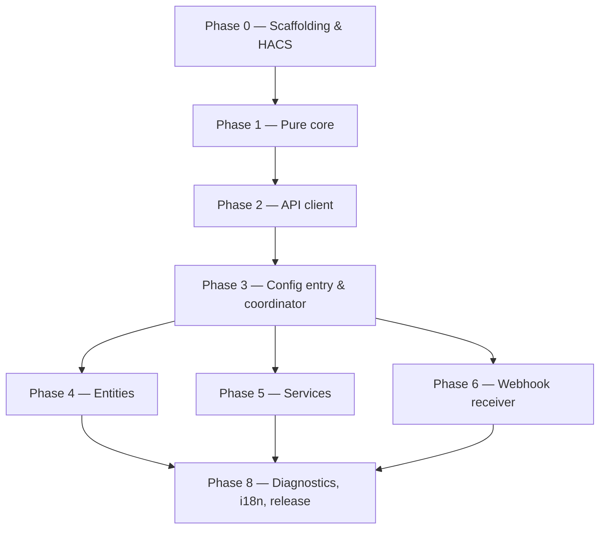

# Implementation Plan — Overview & TDD Contract

**Status:** Implementation plan (input to a TDD build pass)
**Derived from:** [`docs/architecture.md`](../docs/architecture.md), [`docs/setup.md`](../docs/setup.md)
**Deliverable being built:** a HACS-installable Home Assistant custom integration, domain `miniflux`, that wraps one Miniflux instance and exposes sensors, services, and verified webhook events. The integration knows *only* Miniflux — no n8n, no `ai_task`, no scoring (architecture D5).

This document defines *how* the build runs: the TDD contract every chunk obeys, the tooling, the module layout, the fixture strategy, and the sequenced backlog. The eight phase documents (`01`–`08`) contain the chunk-by-chunk detail. Build them **in order**; within a phase, build chunks in listed order. Deviate only when a chunk surfaces a real blocker (record it, see [§7](#7-when-to-deviate)).

---

## 1. What we are building (one screen)

```text
custom_components/miniflux/
  __init__.py          setup/unload entry, wire client+coordinator+services+webhook   (Phase 3,5,6)
  manifest.json        HA + HACS metadata, version, config_flow, iot_class             (Phase 0)
  const.py             DOMAIN, event names, ALL caps/defaults (single source)          (Phase 0)
  models.py            Entry, EntryCompact, Feed, Snapshot (frozen dataclasses)        (Phase 1)
  timeutil.py          time normalization (Miniflux <-> UTC <-> filter params)         (Phase 1)
  normalize.py         raw Miniflux JSON -> models                                     (Phase 1)
  filters.py           entry-filter model -> Miniflux query params + title->id         (Phase 1)
  signature.py         HMAC verify + event-type extraction                             (Phase 1)
  webhook_payload.py   verified body -> typed compact event payload                    (Phase 1)
  rollup.py            feeds+counters -> Snapshot                                       (Phase 1)
  transitions.py       (prev,cur) Snapshot -> feed error/recovered events              (Phase 1)
  errors.py            exception hierarchy + HTTP->typed-error mapping                  (Phase 1)
  api.py               async aiohttp client (the only HTTP in the codebase)            (Phase 2)
  coordinator.py       DataUpdateCoordinator: poll, snapshot, diff, debounce           (Phase 3)
  config_flow.py       config + options + reauth flows                                 (Phase 3)
  entity.py            shared base entity + device                                     (Phase 4)
  sensor.py            unread / starred / feeds-with-errors sensors                    (Phase 4)
  binary_sensor.py     reachability sensor (availability override)                     (Phase 4)
  services.py          query / mutation / admin service handlers                       (Phase 5)
  services.yaml        service field schemas for the HA UI                             (Phase 5)
  webhook.py           receiver: verify -> project -> emit -> nudge                    (Phase 6)
  repairs.py           issue flows (missing/failing webhook secret)                    (Phase 6/8)
  diagnostics.py       redacted diagnostics dump                                       (Phase 8)
  strings.json         + translations/en.json  (flows, services, entities, issues)     (Phase 8)
hacs.json              HACS repo descriptor                                            (Phase 0)
tests/                 mirror of the above; fixtures/ holds recorded Miniflux JSON     (all phases)
.github/workflows/     hassfest + HACS validate + pytest                               (Phase 0)
```

**No third-party runtime dependency** (`manifest.json` `requirements: []`). Architecture D6 chose an embedded async client over the sync PyPI `miniflux` package; the payoff lands here as a simpler HACS package and no dependency resolution.

---

## 2. The TDD contract (applies to every chunk)

Every chunk in phases `01`–`08` is a red→green→refactor unit and is **Done** only when all boxes hold:

- [ ] **Red first.** The chunk's listed tests are written and *failing* before any implementation of that chunk exists. Each phase doc lists the tests to write, phrased as assertions, not as prose.
- [ ] **Green.** Minimum implementation makes exactly those tests pass. No speculative code beyond the chunk's stated public surface.
- [ ] **Refactor.** Code cleaned; the seam rules in [§4](#4-seam-discipline) still hold (entities don't call the client, services don't parse HTTP, etc.).
- [ ] **Lint/type clean.** `ruff` clean; type hints on all public functions.
- [ ] **Coverage floor met** (per [§5](#5-coverage-floors)).
- [ ] **Gates green.** `hassfest` and `hacs/action` pass (they run cheaply and catch manifest/packaging regressions early).
- [ ] **No cross-chunk debt.** If the chunk revealed a needed change in an earlier chunk's contract, that change is made and the earlier tests updated — not deferred.

A chunk is **individually testable**: its tests must pass with only prior chunks present. If a test needs a not-yet-built chunk, either the ordering is wrong (fix the sequence) or the seam is wrong (the dependency should be injected/faked, not built).

**Test-intent notation.** Phase docs describe tests as `given → when → then`. The implementer writes the actual `pytest` functions. Conceptual signatures are given for the code under test so tests can be written first; they are contracts, not code to copy verbatim.

---

## 3. Tooling & harness (established in Phase 0, used everywhere)

| Concern | Choice | Notes |
|---|---|---|
| Test runner | `pytest` + `pytest-homeassistant-custom-component` | The plugin supplies HA fixtures (`hass`, `enable_custom_integrations`, config-entry helpers) and pins a compatible HA version. |
| Async | `pytest-asyncio` (via the plugin) | HA is asyncio-native. |
| HTTP mocking | `aioresponses` (or the plugin's `aioclient_mock`) | Phase 2 client tests never hit a network. Prefer `aioclient_mock` for parity with HA's shared session. |
| Coverage | `pytest-cov` | Floors in §5, enforced in CI. |
| Lint/format | `ruff` | Mirror HA core's ruleset where practical. |
| HA metadata gate | `home-assistant/actions` hassfest | Validates `manifest.json`, services, translations. |
| HACS gate | `hacs/action` with `category: integration` | Validates repo structure, `hacs.json`, brand presence (warn). |

`tests/conftest.py` provides `enable_custom_integrations` (autouse) and shared builders: a fake API client, a snapshot factory, a config-entry factory, and a signed-webhook-request helper. These builders are themselves Phase-0/Phase-1 deliverables so later phases inject rather than reconstruct.

**Fixture library (`tests/fixtures/`).** Recorded/synthetic Miniflux JSON for every endpoint and both webhook event types, plus edge cases (feed without category, deleted-feed counter, parsing-error feed, 200-entry webhook, malformed entry). This library is the concrete resolution of risk **R1** (exact wire shapes): each fixture is tagged with the Miniflux version it was captured from, and the contract-pinning task (R1) refreshes it against the real instance before Phase 2 freezes. Pure-core tests (Phase 1) consume the *parsed* edge cases; client tests (Phase 2) consume the *raw* HTTP bodies.

---

## 4. Seam discipline (architecture §8.4, enforced by tests)

These five rules are the reason the plan is testable in the order given. A violation shows up as a test that suddenly needs a running HA instance or a live socket — treat that as a design bug in the chunk, not a reason to loosen the test.

1. **Entities never call the client.** They render `coordinator.data` (a `Snapshot`) only. → tested by injecting a snapshot, no client present.
2. **Services never parse HTTP.** They validate (schema + pure `filters`), call `api`, and shape responses via pure mappers. → tested against a fake client.
3. **The webhook handler is a thin shell** over `signature.verify` + `webhook_payload.parse_and_project` + event emit. → the interesting logic is tested with no HTTP (Phase 1); the shell is tested through HA's test client (Phase 6).
4. **The coordinator's diff is pure.** `transitions.diff(prev, cur)` is a plain function. → tested with two hand-built snapshots.
5. **Every cap/constant lives in `const.py`.** No magic numbers in logic. → tuning (R5) and tests touch one file.

Corollary: **all HTTP lives in `api.py`, all Miniflux field-name knowledge lives in `api.py` + `normalize.py`**. When R1 pins the real header/field names, the blast radius is those two modules plus fixtures.

---

## 5. Coverage floors

| Ring | Modules | Floor | Rationale |
|---|---|---|---|
| Pure core | Phase 1 modules | **100%** line + branch | No I/O, no framework — no excuse; these encode the tricky logic (truncation, diffing, signature, time). |
| Adapter | `api.py` | ≥ 95% | Error branches and retry/pagination paths must be exercised against fakes. |
| HA-coupled | coordinator, flows, entities, services, webhook shell | ≥ 90% | Some HA glue is hard to branch-cover; don't chase the last few % into meaningless tests. |

CI fails under floor. Floors are per-module, not global, so a well-covered pure core can't mask a thin client.

---

## 6. Build sequence (the backlog)

Strictly sequential. Each phase depends only on those before it. IDs (`P1.4`) are stable references for the implementer's queue and for cross-references.



| Phase | Doc | Produces | Gated by |
|---|---|---|---|
| 0 | [`01-scaffolding-and-hacs.md`](./01-scaffolding-and-hacs.md) | Package skeleton, `manifest.json`, `hacs.json`, CI, `const.py`, test harness | hassfest + HACS action green on an empty integration; `pytest` collects |
| 1 | [`02-pure-core.md`](./02-pure-core.md) | 9 dependency-free modules (models…errors) | 100% coverage; no `homeassistant` import in any Phase-1 module |
| 2 | [`03-api-client.md`](./03-api-client.md) | `api.py` over fixtures | ≥95% coverage; zero live sockets in tests |
| 3 | [`04-config-and-coordinator.md`](./04-config-and-coordinator.md) | config/options/reauth flows, coordinator, `__init__` wiring | Config-flow + coordinator tests pass; setup/unload clean |
| 4 | [`05-entities.md`](./05-entities.md) | sensors + reachability binary sensor + device | Pure-projection tests over injected snapshots |
| 5 | [`06-services.md`](./06-services.md) | query/mutation/admin services + `services.yaml` | Schema-validation-before-HTTP tests; response envelopes |
| 6 | [`07-webhook-receiver.md`](./07-webhook-receiver.md) | webhook endpoint + repairs | Signed→event→200, bad-secret→401, malformed→400 |
| 7 | *(reserved — no phase; kept so numbering matches doc index below)* | — | — |
| 8 | [`08-diagnostics-i18n-release.md`](./08-diagnostics-i18n-release.md) | diagnostics, translations, README, release/HACS submission | Full suite green; release tag cut |

> Doc filenames are `01`–`08`; "Phase 7" is intentionally folded into Phase 6/8 (repairs ship with the webhook that raises them, polish ships at release). The index above is the source of truth for what each file covers.

---

## 7. When to deviate

Sequential is the default. Stop and record a deviation (in the phase doc's "Deviations" footer, and flag to the human) only when:

- A chunk can't be made red-then-green without code from a *later* phase → the sequence or a seam is wrong; fix the plan, don't build ahead silently.
- The R1 contract-pinning reveals a wire shape that breaks a Phase-1 assumption (e.g., counters endpoint absent) → adjust `api.py`/`rollup.py` contract and the affected Phase-1 tests before proceeding.
- An HA API used by a chunk needs a higher HA floor than the manifest declares → bump the floor in `manifest.json`/`hacs.json` and note it (R7).

Everything else — including "this later phase would be easier if I tweak an earlier module" — is handled by editing the earlier chunk and its tests, then continuing. No forward-building.

---

## 8. Definition of Done for the whole integration

- Installs cleanly via HACS as a custom repository and configures through the UI (URL + API key), producing the four entities.
- The two-phase webhook handshake (architecture D9 / `docs/setup.md` Part 2) works end to end; a signed delivery becomes a `miniflux_new_entries` event and only a verified one does.
- All services in [`06-services.md`](./06-services.md) callable from a script, returning the documented envelopes, failing loudly on bad input and on Miniflux errors.
- Degraded states are visible (reachability sensor, feeds-with-errors sensor, feed-error/recovered events, reauth flow, repair issues) — nothing fails silently (architecture Resilience / D10).
- `hassfest` + `hacs/action` green; coverage floors met; a versioned GitHub release exists.
- Open risks R1–R10 either resolved or explicitly carried into the release notes as known limitations (notably R3: no tag-write API).
